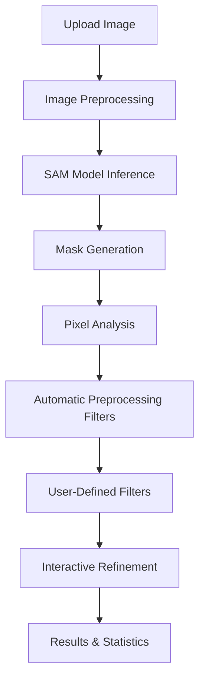

# SAM Droplet Segmentation System

A production-ready, containerized web service for automated droplet and particle segmentation using Meta's Segment Anything Model (SAM). This system provides intelligent image analysis with advanced filtering capabilities for biological and scientific imaging applications.

## 🌟 Overview

The SAM Droplet Segmentation System is a comprehensive solution that combines:
- **Meta's SAM Model**: State-of-the-art computer vision for automatic mask generation
- **Advanced Filtering**: Pixel-level analysis and intelligent filtering algorithms
- **Production Architecture**: Containerized deployment with security and monitoring
- **Web Interface**: User-friendly interface for interactive analysis
- **REST API**: Programmatic access for integration with other systems

## 🏗️ System Architecture

```
┌─────────────────────────────────────────────────────────────────┐
│                    Internet/Users                                │
└─────────────────────┬───────────────────────────────────────────┘
                      │ HTTPS Requests
                      ▼
┌─────────────────────────────────────────────────────────────────┐
│                 Cloudflare Edge Network                         │
│  ┌─────────────────┐  ┌─────────────────┐  ┌─────────────────┐  │
│  │   DDoS Shield   │  │  SSL/TLS Cert   │  │   Global CDN    │  │
│  └─────────────────┘  └─────────────────┘  └─────────────────┘  │
└─────────────────────┬───────────────────────────────────────────┘
                      │ Encrypted Tunnel
                      ▼
┌─────────────────────────────────────────────────────────────────┐
│                  Docker Container Environment                   │
│  ┌───────────────────────────────────────────────────────────┐  │
│  │              SAM Application Container                    │  │
│  │  ┌─────────────────┐  ┌─────────────────┐                │  │
│  │  │   Flask App     │  │  SAM Model      │                │  │
│  │  │   (Gunicorn)    │  │  mobile_sam.pt  │                │  │
│  │  └─────────────────┘  └─────────────────┘                │  │
│  │  ┌─────────────────┐  ┌─────────────────┐                │  │
│  │  │ Auth Middleware │  │  Filter Engine  │                │  │
│  │  │ Rate Limiting   │  │  Pixel Analysis │                │  │
│  │  └─────────────────┘  └─────────────────┘                │  │
│  └───────────────────────────────────────────────────────────┘  │
└─────────────────────────────────────────────────────────────────┘
```

## 🔄 Workflow Overview

### 1. Image Processing Pipeline



### 2. Filtering Strategy

The system applies a **two-stage filtering approach**:

#### Stage 1: Automatic Preprocessing Filters
- **Area Outlier Removal**: Removes masks >50% larger than average
- **Edge-Touching Removal**: Removes incomplete objects touching image borders
- **Circularity Filtering**: Removes non-circular shapes (< 0.6 circularity)

#### Stage 2: User-Defined Filters
- **Intensity-Based**: Filter by brightness, contrast, and pixel ranges
- **Size-Based**: Filter by area and diameter measurements
- **Spatial**: Filter by edge proximity and position
- **Interactive**: Manual click-to-filter for fine-tuning

## 🚀 Quick Start

### Option 1: Docker Deployment (Recommended)

```bash
# Clone the repository
git clone https://github.com/gavinlouuu-kpt/sam_droplet.git
cd sam_droplet

# Start the containerized service
docker compose up -d

# Check service status
docker compose ps

# View logs
docker compose logs -f
```

The service will be available at `http://localhost:9487`

### Option 2: Local Development

```bash
# Install dependencies
pip install -r requirements_server.txt

# Download SAM model (place in model/ directory)
# mobile_sam.pt or sam_vit_h_4b8939.pth

# Start the Flask application
python app.py
```

## 🌐 API Usage

### Authentication
All API endpoints require authentication via API key:

```bash
# Include this header in all requests
-H "X-API-Key: your-api-key"
```

### Available Endpoints

#### 1. Health Check (Public)
```bash
curl https://tally-o.gavinlou.com/health
```

#### 2. Image Segmentation
```bash
# Base64 image data
curl -X POST \
  -H "X-API-Key: sam-demo-key-123" \
  -H "Content-Type: application/json" \
  -d '{"image": "data:image/png;base64,iVBORw0KGgo..."}' \
  https://tally-o.gavinlou.com/segment

# File upload
curl -X POST \
  -H "X-API-Key: sam-demo-key-123" \
  -F "file=@image.jpg" \
  https://tally-o.gavinlou.com/segment_file
```

#### 3. Image Analysis
```bash
curl -X POST \
  -H "X-API-Key: sam-demo-key-123" \
  -F "file=@image.jpg" \
  https://tally-o.gavinlou.com/analyze_image
```

### Request with Filters
```bash
curl -X POST \
  -H "X-API-Key: sam-demo-key-123" \
  -H "Content-Type: application/json" \
  -d '{
    "image": "data:image/png;base64,iVBORw0KGgo...",
    "filters": {
      "mean_min": 140,
      "area_min": 50,
      "area_max": 5000,
      "exclude_edge_touching": true
    },
    "preprocessing": {
      "gaussian_blur": true,
      "contrast_enhancement": true
    }
  }' \
  https://tally-o.gavinlou.com/segment
```

## 🎯 Use Cases & Applications

### Biological Imaging
- **Droplet Counting**: Digital PCR droplets, emulsion droplets
- **Cell Segmentation**: Individual cell identification and counting
- **Particle Analysis**: Microparticles, beads, and vesicles

### Quality Control
- **Manufacturing**: Defect detection in products
- **Materials Science**: Particle size distribution analysis
- **Food Industry**: Contamination detection

### Research Applications
- **Microscopy**: Automated analysis of microscopic images
- **Flow Cytometry**: Particle characterization
- **Drug Discovery**: Compound screening and analysis

## 🔧 Advanced Filtering

### Filter Types

#### Intensity-Based Filters
```json
{
  "mean_min": 140,        // Minimum average brightness
  "mean_max": 200,        // Maximum average brightness
  "min_threshold": 50,    // Minimum pixel value in object
  "max_threshold": 250,   // Maximum pixel value in object
  "std_min": 10,          // Minimum intensity variation
  "std_max": 30           // Maximum intensity variation
}
```

#### Size and Shape Filters
```json
{
  "area_min": 50,         // Minimum area in pixels
  "area_max": 5000,       // Maximum area in pixels
  "circularity_min": 0.7  // Minimum circularity (0-1)
}
```

#### Spatial Filters
```json
{
  "min_edge_distance": 20,      // Minimum distance from edges
  "exclude_edge_touching": true  // Exclude edge-touching objects
}
```

### Common Filter Presets

#### Bright Droplets
```json
{
  "mean_min": 140,
  "area_min": 50,
  "area_max": 5000,
  "std_max": 20,
  "exclude_edge_touching": true
}
```

#### Dark Particles
```json
{
  "mean_max": 80,
  "min_threshold": 10,
  "area_min": 20,
  "area_max": 2000
}
```

#### Complete Objects Only
```json
{
  "exclude_edge_touching": true,
  "min_edge_distance": 10,
  "area_min": 100
}
```

## 📊 Analysis Features

### Pixel Statistics
For each detected object:
- **Mean Intensity**: Average pixel brightness
- **Intensity Range**: Min/max pixel values
- **Standard Deviation**: Intensity variation (texture measure)
- **Pixel Count**: Total pixels in object

### Morphological Measurements
- **Area**: Object size in pixels
- **Maximum Feret Diameter**: Longest distance across object
- **Circularity**: Shape roundness measure (0-1)
- **Bounding Box**: Object boundaries

### Spatial Analysis
- **Edge Proximity**: Distance to nearest image edge
- **Edge Touching**: Whether object touches image border
- **Position**: Object centroid coordinates

## 🔒 Security Features

### Multi-Tier Authentication
- **API Key System**: Different access levels and rate limits
- **Admin Keys**: Administrative access to statistics and health
- **Rate Limiting**: Per-key request throttling

### Production Security
- **HTTPS Encryption**: All traffic encrypted via Cloudflare
- **DDoS Protection**: Cloudflare edge protection
- **Container Isolation**: Sandboxed execution environment
- **Input Validation**: File type and size validation

## 📈 Monitoring & Maintenance

### Health Monitoring
```bash
# Container health
docker compose ps

# Application health
curl https://tally-o.gavinlou.com/health

# Admin health check
curl -H "X-Admin-Key: admin-key" \
  https://tally-o.gavinlou.com/admin/health
```

### Usage Statistics
```bash
# Get API usage statistics
curl -H "X-Admin-Key: admin-key" \
  https://tally-o.gavinlou.com/admin/stats
```

### Log Management
```bash
# View application logs
docker compose logs -f sam-app

# View all service logs
docker compose logs -f
```

## 🛠️ Configuration

### Environment Variables
```env
# Security
API_KEYS=key1:name1:limit1,key2:name2:limit2
ADMIN_API_KEY=admin-secret-key
HEALTH_CHECK_KEY=health-monitor-key

# Performance
OMP_NUM_THREADS=4
MAX_FILE_SIZE_MB=50
LOG_LEVEL=INFO

# Model Configuration
SAM_MODEL_PATH=model/mobile_sam.pt
```

### Docker Configuration
- **CPU Deployment**: `docker-compose.yml`
- **GPU Deployment**: `docker-compose.gpu.yml`
- **Development**: Local Flask server

## 📚 Documentation

- **[Quick Reference](QUICK_REFERENCE.md)**: Essential commands and API examples
- **[Filter Guide](README_FILTERS.md)**: Comprehensive filtering documentation
- **[Docker Guide](README_DOCKER.md)**: Container deployment instructions
- **[Server Setup](SERVER_README.md)**: Production deployment guide
- **[Architecture](ARCHITECTURE.md)**: Detailed system architecture

## 🤝 Contributing

1. Fork the repository
2. Create a feature branch
3. Make your changes
4. Add tests if applicable
5. Submit a pull request

## 📄 License

This project is licensed under the MIT License - see the [LICENSE](LICENSE) file for details.

## 🙏 Acknowledgments

- **Meta AI**: For the Segment Anything Model
- **MobileSAM**: For the efficient mobile implementation
- **Cloudflare**: For edge network and tunnel services

## 📞 Support

- **Issues**: [GitHub Issues](https://github.com/gavinlouuu-kpt/sam_droplet/issues)
- **Documentation**: [Project Wiki](https://github.com/gavinlouuu-kpt/sam_droplet/wiki)
- **Email**: gavinlouuu@gmail.com

---

**Live Demo**: https://tally-o.gavinlou.com  
**API Key**: `sam-demo-key-123` (50 requests/hour) 